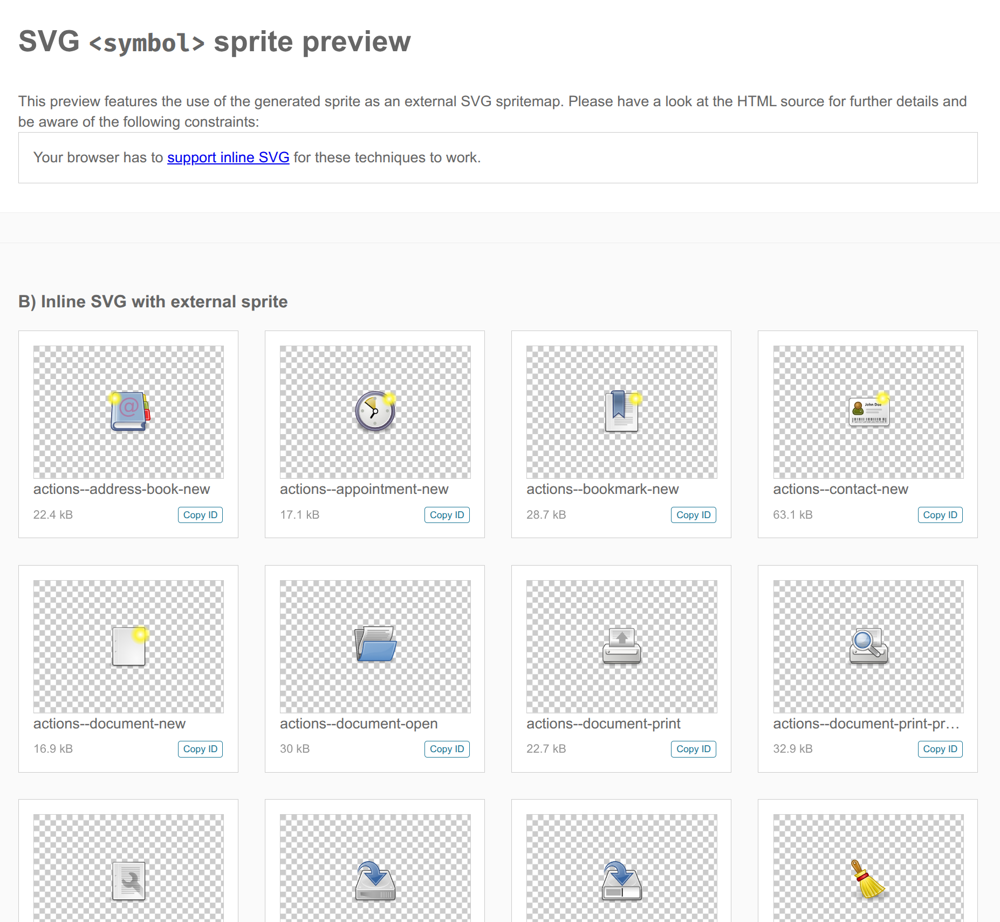
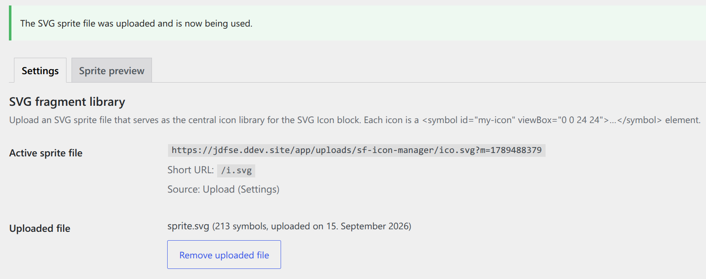
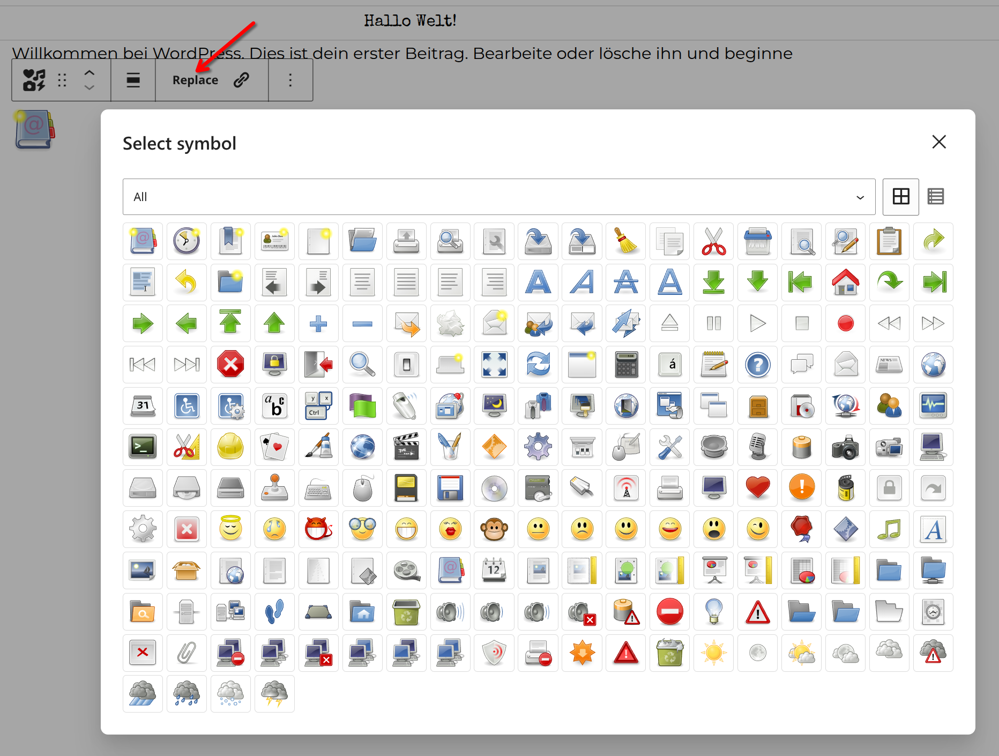

The **SVG Forge Icon Manager** is a Gutenberg plugin for WordPress: an "SVG Icon" block inserts icons via `<use>` from a central SVG sprite file into your content. The plugin is deliberately *not* an icon collection with an import UI — every icon must exist as a `<symbol>` element in a sprite file that you build, maintain, and version yourself.

This article shows you how to create your own icon set: create a folder full of SVG files, build them with [svgforge-cli](https://github.com/svgforge/svgforge-cli/) into a sprite file in one line, and hook it into the plugin. Including the **directory-marker trick**, which turns your subfolders into filter groups in the icon picker automatically.

As a reference, we use the example repo [svgforge/default-icons](https://github.com/svgforge/default-icons): it contains two ready-made icon sets with a build configuration and shows the structure your own set should have.

## How an Icon Set Is Structured

In its simplest form, an icon set is a folder with SVG files; subfolders form categories:

```text
assets/
├── actions/
│   ├── add_circle.svg
│   └── delete.svg
└── navigation/
    ├── arrow_back.svg
    └── home.svg
```

`svgforge-cli` converts each SVG file into a `<symbol id="…" viewBox="…">` inside a central `sprite.svg`. The sprite structure is simple — exactly what the plugin expects:

```xml
<svg xmlns="http://www.w3.org/2000/svg">
  <symbol id="actions--add_circle" viewBox="0 -960 960 960">
    <path d="M440-280h80v-160…"/>
  </symbol>
  <symbol id="navigation--home" viewBox="0 -960 960 960">
    <path d="M240-200h120v-200h240v200h…"/>
  </symbol>
</svg>
```

The editor loads this sprite, shows each `<symbol>` as a clickable icon, and later references the selected icon as `<use href="sprite.svg#actions--add_circle">`. The `--` notation in the IDs is the link to the picker: the first part (`actions`) becomes a filter group there.

## Step 1: Install svgforge-cli

```bash
npm install --global @svgforge/svgforge-cli
```

`svgforge-cli` sanitizes the SVGs (removes scripts, event handlers, `javascript:` links) and optimizes them with SVGO — the very sprite that the plugin additionally re-checks on upload as a safety net.

## Step 2: Create Your Icon Folder

Create a folder with your SVG files and sort them into subfolders as you like. The folder name later becomes the group name in the picker — so choose a descriptive name:

```text
assets/
├── actions/
│   └── add_circle.svg
└── communication/
    └── mail.svg
```

## Step 3: The Directory-Marker Trick

The build command looks like this:

```bash
svgforge --symbol --dest=out 'assets/./**/*.svg'
```

The trick is the `./` right in the middle of the glob: it is the **directory marker**. Everything before it is only the base from which the icon ID is calculated. Without the marker, the base folder name would bleed into every ID:

| Glob | Icon ID | Group |
|---|---|---|
| `assets/**/*.svg` | `assets--actions--add_circle` | `assets` (single, useless group) |
| `assets/./**/*.svg` | `actions--add_circle` | `actions` |

With `./`, you get compact IDs like `actions--add_circle` from `assets/actions/add_circle.svg`. The base name `assets` disappears, and each subfolder level becomes a `--` segment — the picker turns it into the group filter. Without the marker, all icons would share the identical `assets--` prefix and the filter would be useless.

## Step 4: Generate the Sprite

```bash
svgforge --symbol --dest=out 'assets/./**/*.svg'
```

After the run, the finished sprite lives at `out/symbol/sprite.svg`. If you prefer working with configuration files instead (for example, to remove the `fill` attribute), take a look at the `material.json` in the [default-icons](https://github.com/svgforge/default-icons) repository:

```json
{
  "dest": "./dist/material",
  "shape": {
    "transform": [
      {
        "svgo": {
          "plugins": [
            { "name": "removeAttrs", "params": { "attrs": "fill" } }
          ]
        }
      }
    ]
  },
  "mode": {
    "symbol": { "sprite": "sprite.svg", "render": { "css": false } }
  }
}
```

This lets you run set-wide transformations — in the example, the `fill` attribute of all Material icons is removed so they stay monochrome and can be colored via the block's color controller.



## Step 5: Hand the Sprite to the Plugin

There are two sensible ways. The **filter** is recommended because the file then lives in the theme repo and is versioned along with it (if you use Git) — in `functions.php`:

```php
add_filter( 'sfim_sprite_url', fn () => get_theme_file_uri( 'assets/ico.svg' ) );
```

The filter wins against everything else, including an upload. Alternatively, you can upload the file via **Settings → SVG Forge Icon Manager** in the backend (the plugin settings page calls it "SVG fragment library"). The plugin detects the `<symbol>` elements immediately.



## Step 6: Use Icons in the Editor

Add the **SVG Icon** block, click "Replace", and pick an icon from the picker. The picker shows all `<symbol>` elements with a live preview, offers a group filter (if subdirectories were used) and a grid/list view. You configure color (Fill/Stroke), size (standard dimensions panel with preset slider), and links per block.



## Reference: svgforge/default-icons

The [svgforge/default-icons](https://github.com/svgforge/default-icons) repo is a ready-made example for exactly this pipeline:

- **`material/`** — 34 monochrome Material icons (Apache 2.0, via Google Fonts) in six categories (`actions`, `communication`, `content`, `navigation`, `people`, `status`). The trick (removing `fill` via config) makes them colorable through `currentColor`.
- **`tango/`** — 213 multicolored Tango icons (Public Domain) in nine categories (`actions`, `apps`, `categories`, `devices`, `emblems`, `emotes`, `mimetypes`, `places`, `status`).
- **Build**: `build.sh` calls `svgforge -C material.json 'material/./**/*.svg'` (and analogously `tango.json`) and then starts a local preview server. The finished sprites live at `dist/<set>/symbol/sprite.svg`; the `example: true` flag additionally generates an HTML preview of the whole group.

So you can also download a set directly and hook it into the plugin without building it yourself.

## Monochrome or Multicolored?

The plugin distinguishes automatically: multicolored sets (like Tango) keep their built-in colors — the color controller has no visible effect there. Monochrome icons (`fill: currentColor` or no fixed fill) follow the block's chosen color — that is the basis of the Material configuration above, which consistently removes `fill`.

## Conclusion

A custom icon set is therefore: a folder with SVG files, a build command with the `./` directory marker, and an upload (or a filter) in the plugin. The subfolders automatically become filter groups in the picker. The structure and configs from [svgforge/default-icons](https://github.com/svgforge/default-icons) serve as a starting point.

**Tip:** If you work with a CI/CD pipeline, you can add your icons as individual SVGs to your theme. A GitHub workflow generates the `sprite.svg` during the build — the installable ZIP then contains the theme including the generated `sprite.svg`.